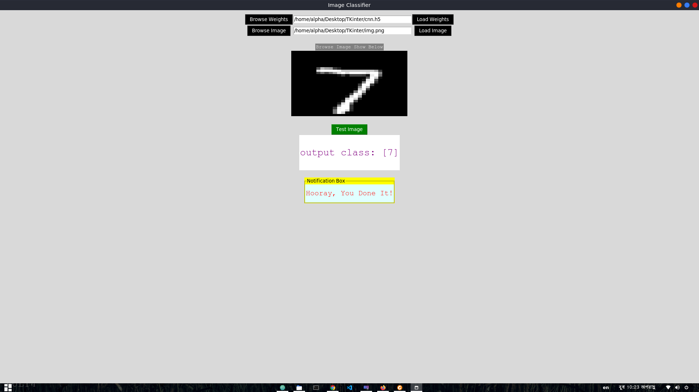

# CNN---Image-Classification-App
A python based Desktop Demo  App. This app used for any Image classification application.

# [PYTORCH] YOLO (You Only Look Once)

## Introduction
This is a deep learning project. I used Convolutional Neural Networks to classify MNIST handwritten data. For more convenient propose of test data, used Tkinter to deploy a desktop app that can run any Os. You just need to select an image then all work done by this app.

   
  <i>An example of Apps output.</i>

## How to use my code

With my code, you can:
* **Run cnn.py => Train CNN model from scratch and save weight as h5 file**
* **Run App.py**
* **load weights and image for test**
* **click test image button**

## Dependencies:

* **python 3**
* **Tensorflow**
* **Keras**
* **opencv (cv2)**
* **Numpy**
* **Pillow** 
* 

## Datasets:

I used 4 different datases: VOC2007, VOC2012, COCO2014 and COCO2017. Statistics of datasets I used for experiments is shown below

| Dataset                | Classes | #Train images/objects | #Validation images/objects |
|------------------------|:---------:|:-----------------------:|:----------------------------:|
| MNIST                  |    10     |      600000             |           100000             |

